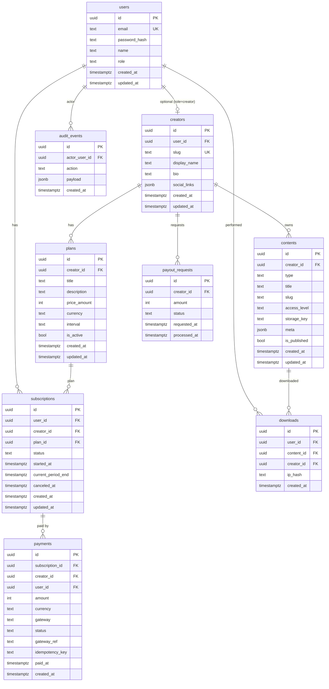

# DATABASE_SCHEMA — طرح دیتابیس، ERD و ایندکس‌ها (PostgreSQL)

## اصول
- کلیدها: UUID
- timestamps: `created_at`, `updated_at`
- soft delete: `deleted_at` برای موجودیت‌های حساس (اختیاری)
- پول: **ریال/تومان** را واضح مشخص کن. پیشنهاد: ذخیره در «ریال» به صورت integer.

---

## ERD (Mermaid)

---

## ایندکس‌ها (پیشنهادی)
- `users(email)` unique
- `creators(slug)` unique
- `plans(creator_id, is_active)`
- `subscriptions(user_id, status)`, `subscriptions(creator_id, status)`
- `payments(gateway, gateway_ref)` unique (برای جلوگیری از duplicate callback)
- `payments(idempotency_key)` unique nullable
- `contents(creator_id, is_published)`, `contents(creator_id, slug)` unique per creator
- `downloads(user_id, created_at)`

---

## نکته‌های ضدتقلب/امنیت
- در downloads: ip_hash (نه ip خام) + rate limit سمت API
- storage_key برای فایل‌ها فقط در سرور resolve می‌شود (لینک مستقیم public نده)
